# Sistema Bancario – Java GUI y PostgreSQL
Sistema Bancario en lenguaje Java GUI y base de datos PostgreSQL, Proyecto del **quinto semestre** de estudios de Ingeniería Informática, presentado el **17/01/20**.

## Descripción

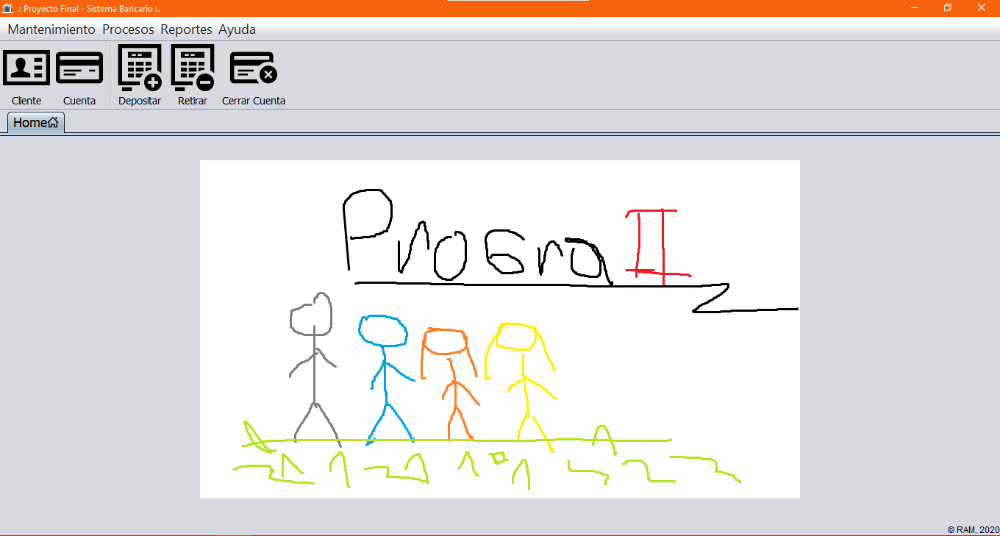

<strong>Imagen:</strong> GUI principal.

## Uso
1. [**Mantenimiento**](#mantenimiento)
   - [**Registrar Cliente**](#registrar-cliente)
   - [**Registrar Cuenta**](#registrar-cuenta)
2. [**Procesos**](#procesos)
   - [**Depositar dinero a una cuenta**](#depositar-dinero)
   - [**Retirar dinero de una cuenta**](#retirar-dinero)
   - [**Cerrar una cuenta**](#cerrar-cuenta)
3. [**Reportes**](#reportes)
   - [**Listado general de cuentas**](#listado-general-de-cuentas)
   - [**Mostrar cuentas creadas en un año especifico**](#mostrar-cuentas-creadas-en-un-año-especifico)
   - [**Listado de cuentas de un cliente especifico**](#listado-de-cuentas-de-un-cliente-especifico)
   - [**Mostrar la cantidad de cuentas existentes de acuerdo al tipo de moneda**](#mostrar-la-cantidad-de-cuentas-existentes-de-acuerdo-al-tipo-de-moneda)
   - [**Listado de cuentas cerradas**](#listado-de-cuentas-cerradas)
4. [**Ayuda**](#ayuda)
   - [**Acerca de**](#acerca-de)

## Mantenimiento

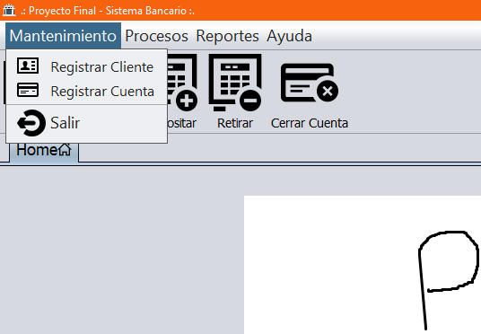

<strong>Imagen:</strong> Menú de mantenimiento.

### Registrar Cliente
Registro de datos de un Cliente como: el número de DNI, el nombre, apellido paterno, apellido materno, la fecha de su nacimiento, la dirección de su casa y su número de teléfono.

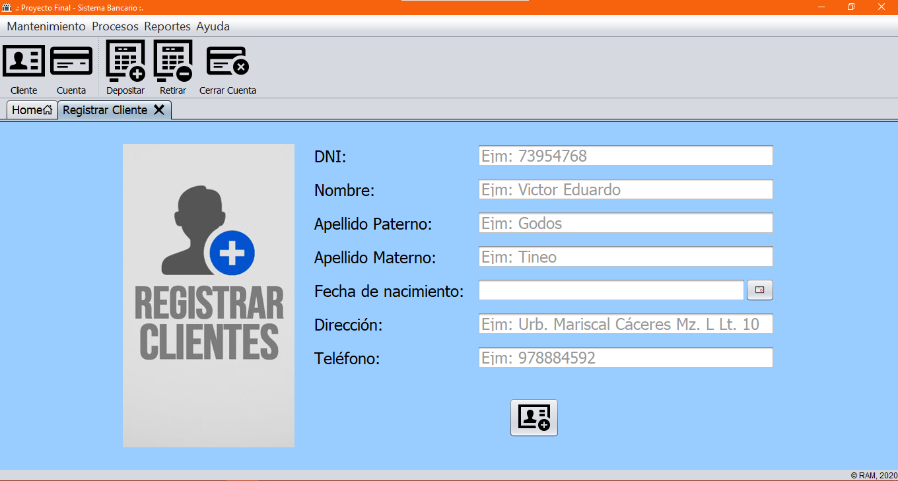

<strong>Imagen:</strong> Registrar cliente.

### Registrar Cuenta
Registro de datos para una Cuenta bancaria que incluyen: el numero de cuenta bancaria, la fecha de apertura de la cuenta, el monto con el que iniciará la cuenta bancaria, tipo de moneda de la cuenta y el número de DNI del cliente a quien pertenecerá la cuenta.

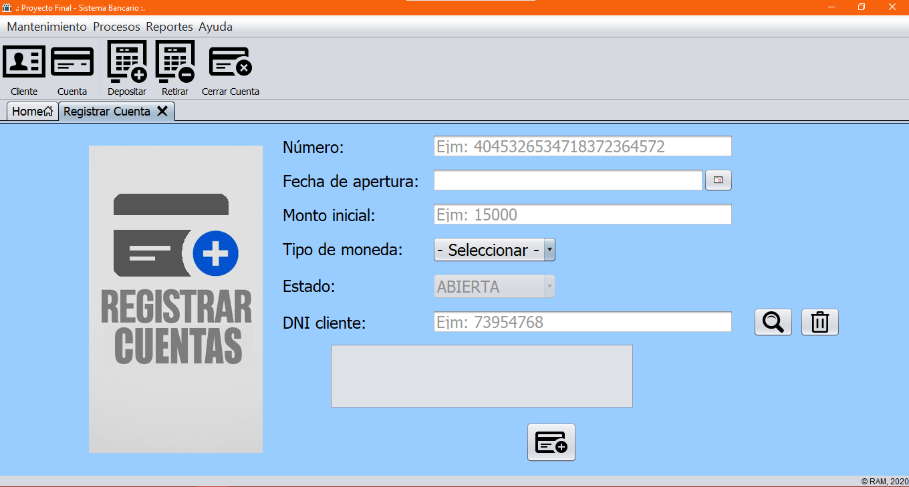

<strong>Imagen:</strong> Registrar cuenta.

## Procesos

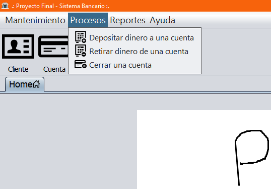

<strong>Imagen:</strong> Menú de procesos.

### Depositar dinero a una cuenta
Para realizar un deposito se debe ingresar un número de cuenta, verificar que existe buscando la cuenta y posteriormente ingresar el monto a depositar.

<strong>Imagen:</strong> Depositar dinero a una cuenta.

### Retirar dinero de una cuenta
Para realizar un retiro se debe ingresar un número de cuenta, verificar que existe buscando la cuenta y posteriormente ingresar el monto a retirar.

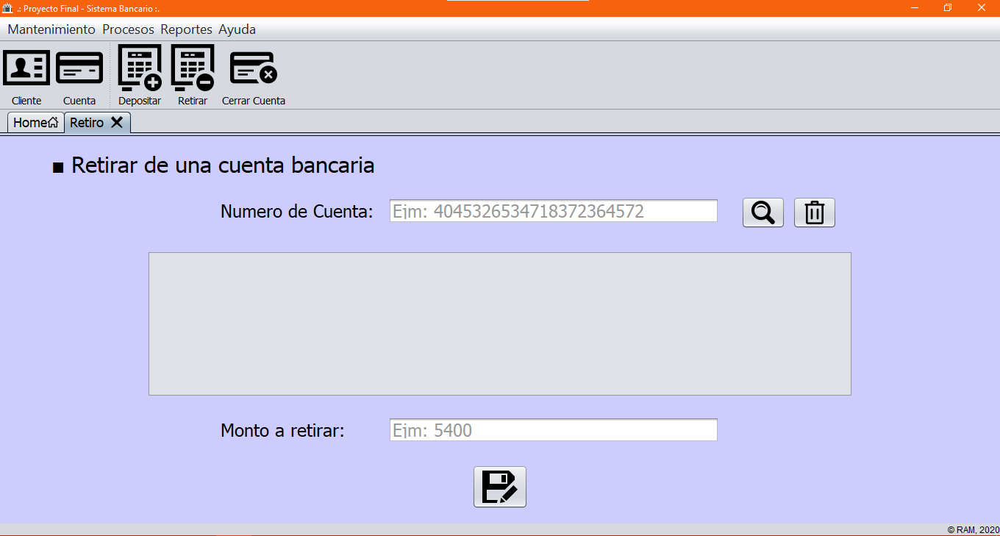

<strong>Imagen:</strong> Retirar dinero de una cuenta.

### Cerrar cuenta
Para cerrar una cuenta se debe ingresar un número de cuenta, verificar que existe buscando la cuenta.

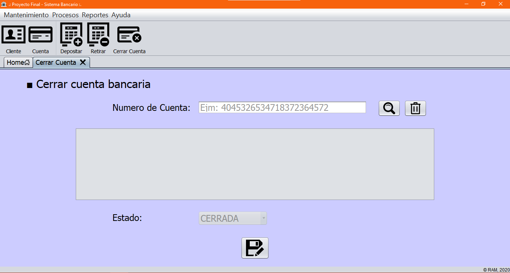

<strong>Imagen:</strong> Cerrar cuenta.

## Reportes

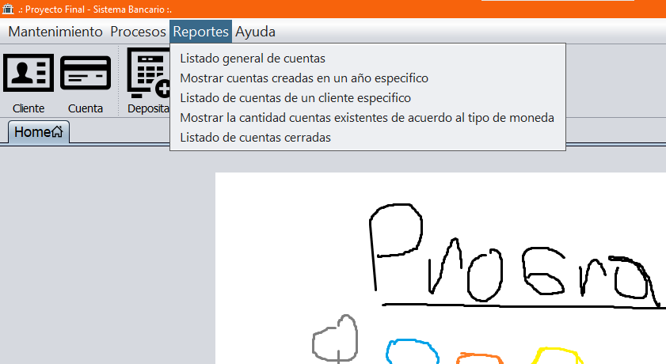

<strong>Imagen:</strong> Menú de reportes.

### Listado general de cuentas 

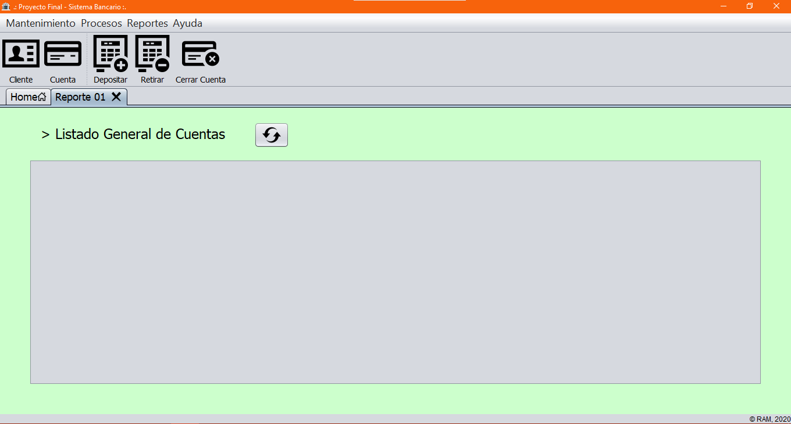

<strong>Imagen:</strong> Listado general de cuentas.

### Mostrar cuentas creadas en un año especifico 

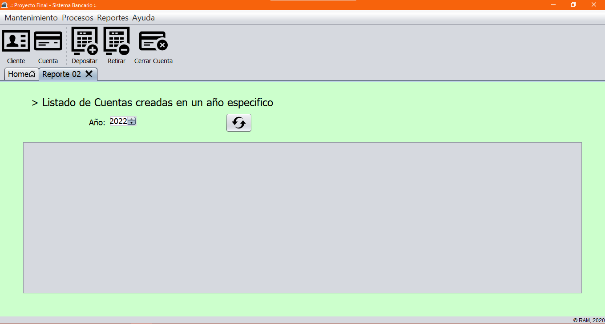

<strong>Imagen:</strong> Mostrar cuentas creadas en un año especifico.

### Listado de cuentas de un cliente especifico

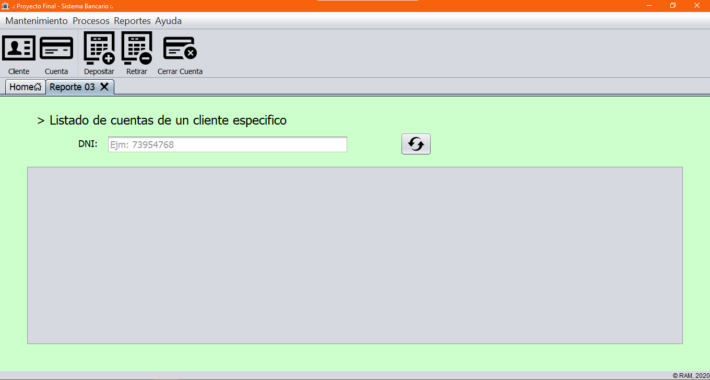

<strong>Imagen:</strong> Listado de cuentas de un cliente especifico.

### Mostrar la cantidad de cuentas existentes de acuerdo al tipo de moneda 

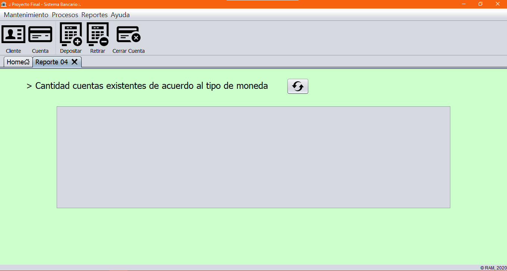

<strong>Imagen:</strong> Mostrar la cantidad de cuentas existentes de acuerdo al tipo de moneda.

### Listado de cuentas cerradas

<strong>Imagen:</strong> Listado de cuentas cerradas.

## Ayuda

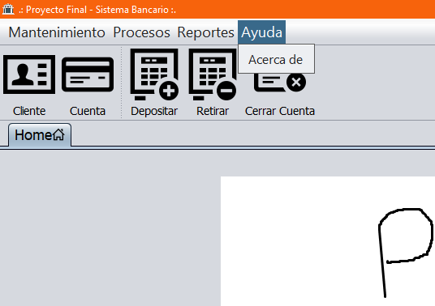

<strong>Imagen:</strong> Menú de ayuda.

### Acerca de
Descripción del sistema, operaciones, reportes e integrantes del proyecto.

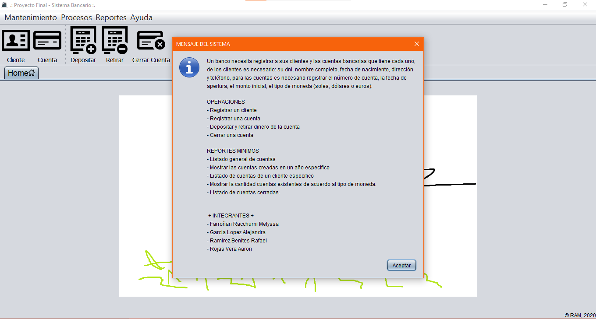

<strong>Imagen:</strong> Acerca de.

## Autores
- Farroñan R. Melyssa
- Garcia L. Alejandra
- Ramirez Benites Rafael
- [Rojas Vera Aarón](https://github.com/Aaron-Shrike)
